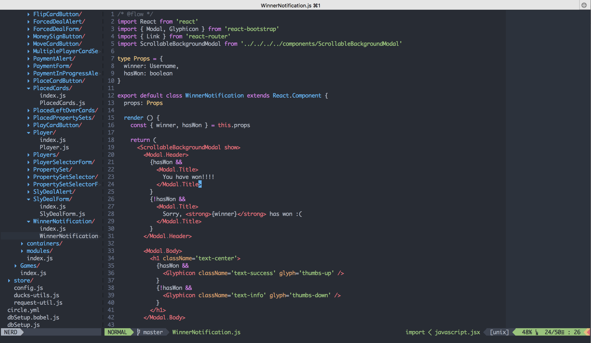

# Vim




### Requirements

* Vim 8 (with python3), or NeoVim


### Installation

```bash
git clone git://github.com/baopham/vim.git ~/.vim
ln -s ~/.vim/vimrc ~/.vimrc
vim +PlugInstall
```
* I use [vim-airline](https://github.com/bling/vim-airline), with Powerline symbols. Try this patched font if you want Powerline symbols: [Monaco for Powerline](https://gist.github.com/baopham/1838072/raw/2c0e00770826e651d1e355962e751325edb0f1ee/Monaco%20for%20Powerline.otf).  

> Shameless plug: I have a lot of settings and plugins and you might not like all of them. You can install [vimplugin-cli](https://github.com/baopham/vimplugin-cli) to quickly find/remove plugins and their settings
